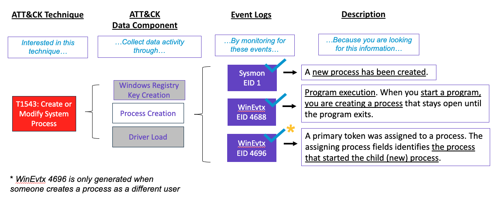

Example Scenarios
==========================

As we worked through some of the event IDs to ATT&CK data source mappings, we found that not all events are created equal in regards to detecting ATT&CK techniques. Two events with the same field names can represent different data.  

For example, both T1134: Access Token Manipulation and T1543: Create or Modify System Process include Process Creation. However, through our list of mappings, process creation includes Sysmon 1, WinEvtx 4688, and WinEvtx 4696. As we moved through research, our first assumption was that Sysmon 1 and WinEvtx 4688 will potentially detect T1543 but WinEvtx 4696 can be an additional detection for T1134. 

So below we go through some examples of why certain Events work to detect certain ATT&CK techniques.

Windows
-------

T1543 Create or Modify System Process
~~~~~~~~~~~~~~~~~~~~~~~~~~~~~~~~~~~~~

Our first scenario is to look into why WinEvtx 4696 is not a feasible detection for T1543: Create or Modify System Process. 

We start by asking ourselves, "**is there enough proof or evidence to say this system process was created or modified?**"

`Sysmon EID 1 <https://www.ultimatewindowssecurity.com/securitylog/encyclopedia/event.aspx?eventid=90001>`_ was a resounding "**Yes**". Sysmon EID 1 simply triggers when a new process is created, which (in this context) may be created during installation of new software or as part of automated, repeated execution of software such as services. This event's attributes provides very detailed information about the process and the process execution, which is enough to indicate that this technique could have occurred.

`WinEvtx EID 4688 <https://learn.microsoft.com/en-us/windows/security/threat-protection/auditing/event-4688>`_
was a resounding "**Yes**". When a system process or a user opens an executable, Windows creates a process in which that executable runs. Hence, this event is generated every time a program is started or executed. All necessary details about the executed program, who the program ran as, and the process that started the process is provided by the event, which is enough evidence to indicate that this technique could have occurred.

`WinEvtx EID 4696 <https://learn.microsoft.com/en-us/windows/security/threat-protection/auditing/event-4696>`_
was a "**Yes with a Caveat**". A primary token is an access token that is typically created only by the Windows kernel and is assigned to a process to represent the default security information for that process. This primary token is assigned to a process when the process is created, which is why this event falls under process creation. This event, however, will only be generated when a process (usually a service or a scheduled task) starts under the authority of a different user than the user who created the process. In other words, this event triggers every time a process runs using the non-current access token by changing the "Token Elevation Type", enforced by Window's User Account Control (UAC). 

**Caveat**: This event doesn’t generate when the process starts with the authority of the same user that created the process. For example, if a user with a "limited" (token with decreased privilege) Token Elevation Type (i.e., 3) creates a new process also with a "limited" Token Elevation Type, this event will not be generated. 

Type 3 is the normal value when UAC is enabled and a user simply starts a program from the Start Menu. It's a limited token with administrative privileges removed and administrative groups disabled. The limited token is used when User Account Control is enabled, the application does not require administrative privilege, and the user does not choose to start the program using Run as administrator.

So, not only is all the information needed for the creation of the system process in WinEvtx 4688, including the primary token. But also WinEvtx is deprecated starting from Windows 7 and Windows 2008 R2.

