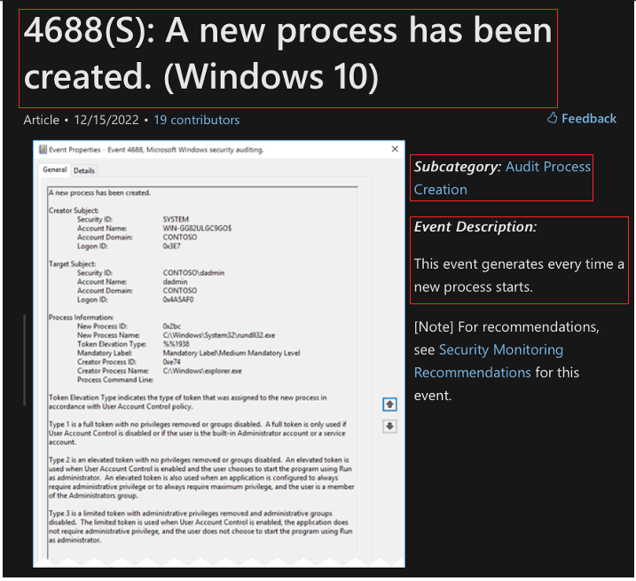
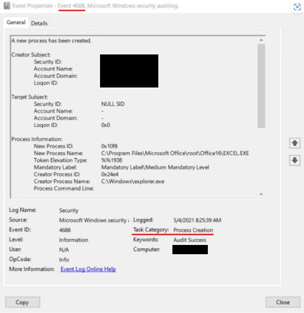

Definitions
===========

This page defines the key terms used throughout our research. 

MITRE ATT&CK 
------------
MITRE ATT&CK® is a globally-accessible knowledge base of adversary tactics and techniques based on real-world observations. ATT&CK focuses on how external adversaries compromise and operate within computer information networks.

Techniques 
~~~~~~~~~~
"how" - the means by which adversaries achieve tactical goals

Sub-techniques
~~~~~~~~~~~~~~
Describes more specific means by which adversaries achieve tactical goals at a lower level than techniques

Data Source 
~~~~~~~~~~~
Source of information collected by a sensor or logging system that may be used to collect information relevant to identifying the action being performed, sequence of actions, or the results of those actions by an adversary

Data Component
~~~~~~~~~~~~~~
Any constituent pieces of the data source, which are best described separately. Components may have their own set of metadata (describing the associated fields/values associated with the source) and activities (describing actions of the source).

ATT&CK Data Sources and Data Components can be found `here <https://attack.mitre.org/datasources/>`_.

Data Elements
-------------
Names, definitions, and attributes that are being used or captured in an event

Sensors
-------
An agent or service capable of detecting or measuring information across many different sources on a host in real-time and providing raw data with high precision and accuracy 

Telemetry/Events
----------------
Generated by sensors in the form of log data, regardless of the format (e.g., json, csv, etc.), as long as the data is automatically generated and transmitted or streamed in near real-time

