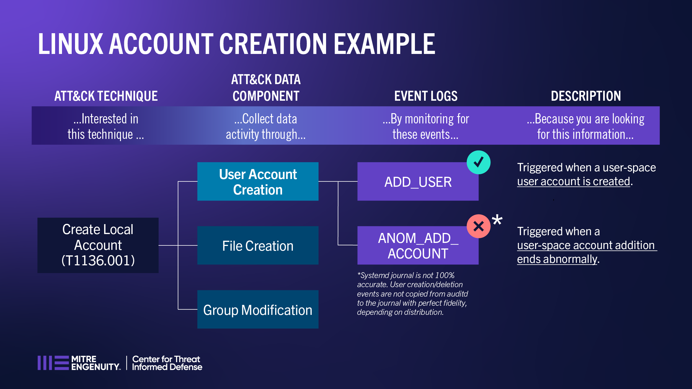

Linux Example Scenario
======================

For example, the mapped Auditd events of ADD_USER and ANOM_ADD_ACCOUNT are considered 
for potential detection of Create Local Account (T1136.001).

Create Local Account (T1136.001)
-------------------------------------------------

This example explores Auditd events mapped to the User Account Creation data component and 
their potential visibility into detecting activity associated with Create Local Account 
(T1136.001). 

1. Looking at the event logs, is this enough proof or evidence to determine that "a local 
   account was created under this technique”?
   
   It could be inferred by the name of the technique and the names of the Auditd events of 
   ADD_USER and ANOM_ADD_ACCOUNT that these events may be associated with the technique. 
   Further context is needed, though to see if these events can be directly associated with 
   the technique.

   Auditd event information: `Linux man page - auditd(8) <https://www.man7.org/linux/man-pages/man8/auditd.8.html>`_

   Use /var/log/audit/audit.log to search on event names.    
   
   Systemd journal is a Linux system service that collects and stores logging data. Systemd 
   journal reflects user creation activity and attendant commands but does not appear to display 
   the event names in RHEL-derived distributions. Also, systemd journal is not 100% accurate. 
   For example, user creation/deletion events are not copied from auditd to the journal with 
   perfect fidelity, depending on distribution.

 * ADD_USER
 
   Yes. This event is triggered when a user-space user account is created, which in this case
   could be directly associated with User Account Creation of a local account.

 * ANOM_ADD_ACCOUNT
   
   No. This event is only triggered when the addition of user-space account ends abnormally. It 
   does not simply provide information specifically for new account creation.
