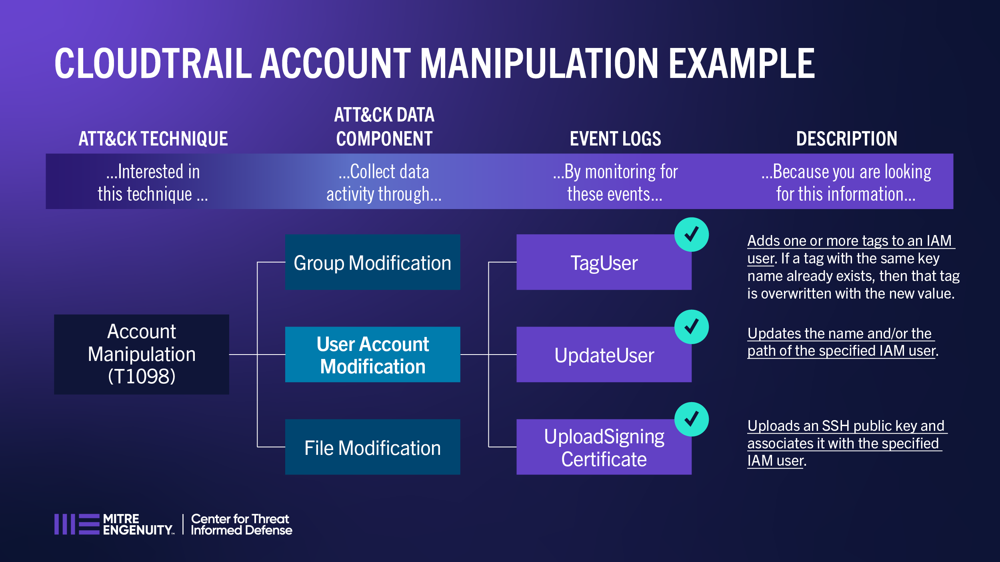
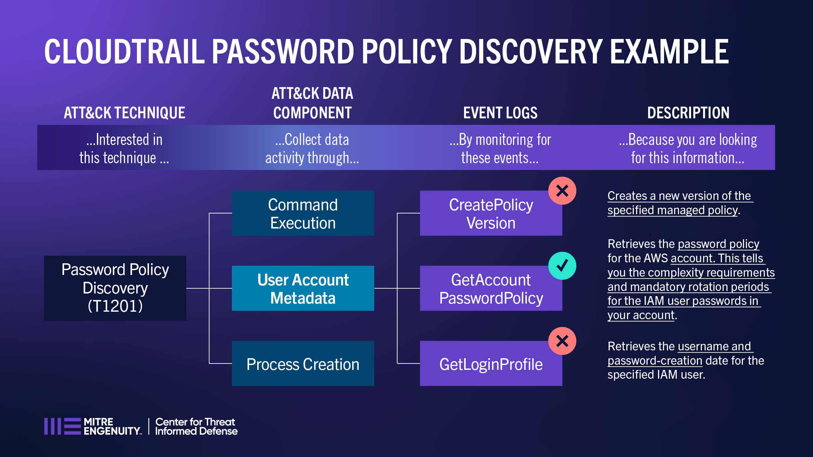

CloudTrail Example Scenarios
============================

Both CloudTrail examples involve User Account data components. The first reviews the use
of User Account Modification to provide visibility into `Account Manipulation (T1098)
<https://attack.mitre.org/techniques/T1098>`__, while the second considers User Account
Metadata for detection of `Password Policy Discovery (T1201)
<https://attack.mitre.org/techniques/T1201>`__ behavior.

Account Manipulation (T1098)
----------------------------

The following are the criteria considered for Account Manipulation (T1098). These were
directly taken by reviewing the definition of the technique.

**Looking at the event data, is this enough evidence to conclude that an account was
manipulated per T1098?** Most CloudTrail events are straightforward, and the associated
API call performs a User Account Modification that meets the criteria for concluding
that an Account Manipulation has occurred.

**TagUser:**

*Yes.* Careful attention was given to CloudTrail Roles, and related information. For
example, the “TagUser/UntagUser” API entry was examined to determine that the act of
Tagging/Untagging met the conditions to change (give or takeaway) access. One concept
that came up was to explore relevant sub-techniques, in case those could provide
additional insight in deciding if an event met the defined conditions:

  * `Additional Cloud Credentials (T1098.001)
    <https://attack.mitre.org/techniques/T1098/001/>`__
  * `Additional Cloud Roles (T1098.003)
    <https://attack.mitre.org/techniques/T1098/003/>`__

*References:*

  * `AWS Documentation - AddTags
    <https://docs.aws.amazon.com/awscloudtrail/latest/APIReference/API_AddTags.html>`__

**UpdateUser:**

*Yes.* Another interesting event is UpdateUser. As an API call, it does not perform a
technical action that results in literal modification of concern (i.e., no access or
permissions for an IAM user is changed). It does not preserve adversary action in a
purely technical sense. HOWEVER: It does qualify because it could be used to “hide in
plain sight” The event is worth noting as potential evidence of (an unexpected) name
change.

*References:*

* `AWS Documentation - UpdateUser
  <https://docs.aws.amazon.com/IAM/latest/APIReference/API_UpdateUser.html>`__

**UploadSigningCertificate:**

*Yes.* This provides the name of the IAM user the signing certificate is for and the
contents of the signing certificate. The elements provide information that can be used
to look for changes to account objects.

*References:*

* `AWS Documentation- UploadSigningCertificate
  <https://docs.aws.amazon.com/IAM/latest/APIReference/API_UploadSigningCertificate.html>`__
* `AWS Documentation - SetSecurityTokenServicePreferences
  <https://docs.aws.amazon.com/IAM/latest/APIReference/API_SetSecurityTokenServicePreferences.html>`__

Password Policy Discovery (T1201)
---------------------------------

The following are the criteria considered for Password Policy Discovery (T1201). These
were directly taken by reviewing the definition of the technique.

**Looking at the event data, is this enough evidence to conclude that attempts were
being made to access detailed information about the password policy per technique
T1201?** This technique may be used by adversaries attempting to access/obtain detailed
password policy information. This policy information may aid the creation of password
lists for dictionary or brute force attacks.

 **CreatePolicyVersion:**

*No.* This contains details about IAM policy versions, but does not provide information
about attempts to access policy documents.

*References:*

* `AWS Documentation - CreatePolicyVersion
  <https://docs.aws.amazon.com/IAM/latest/APIReference/API_CreatePolicyVersion.html>`__

**GetAccountPasswordPolicy:**

*Yes.* The description of T1201 references that “password policies can be discovered in
cloud environments using available APIs such as GetAccountPasswordPolicy in AWS.”

Select examples of User Account Metadata events:

   * AttachRolePolicy
   * AttachUserPolicy
   * CreatePolicy
   * CreatePolicyVersion
   * DeleteAccountPasswordPolicy
   * DeletePolicyVersoin
   * DeleteRolePolicy
   * DeleteUserPolicy
   * DetachUserPolicy
   * DetachRolePolicy
   * ChangePassword
   * GenerateCredentialReport
   * GetAccountPasswordPolicy
   * ListAttachedRolePolicies
   * ListEntitiesForPolicy
   * ListPoliciesGrantingServiceAccess

*References:*

* `AWS Documentation - GetAccountPasswordPolicy
  <https://docs.aws.amazon.com/IAM/latest/APIReference/API_GetAccountPasswordPolicy.html>`__

**GetLoginProfile:**

*No.* This contains information about IAM usernames and password creation dates, not
actual passwords or password policy constructs.

*References:*

* `AWS Documentation - GetLoginProfile
  <https://docs.aws.amazon.com/IAM/latest/APIReference/API_GetLoginProfile.html>`__
