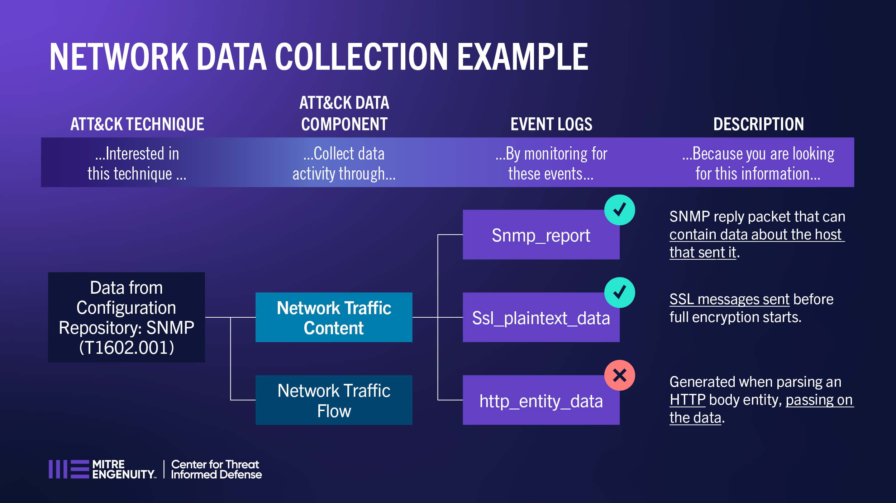

Network Example Scenario
========================

This example explores usage of events detected using network traffic to provide
potential visibility into detecting activity associated with `SNMP (MIB Dump)
(T1602.001) <https://attack.mitre.org/techniques/T1602/001>`__.

Data from Configuration Repository: SNMP (T1602.001)
----------------------------------------------------

The example explores the use of network traffic information to find evidence of the
collection and/or mining of information in a network managed Data from Configuration
Repository: SNMP (T1602.001). Network Traffic Content is a data component of this
technique, and the Zeek events of ``Snmp_report``, ``Ssl_plaintext_data``,
``http_entity_data`` have been mapped to this data component under this project.

**Looking at the event data, is this enough evidence to conclude that data is being
collected or mined using Simple Network Management Protocol (SNMP) per technique
T1602.001?** To find evidence of an adversary gathering data using SNMP, network traffic
can be monitored and analyzed.

**snmp_report:**

*Yes.* Monitor and analyze unusual SNMP reply packet content and inspect information
associated with the host that sent it (e.g. snmp traffic originating from unauthorized
or untrusted hosts, signature detection for strings mapped to device configurations,
anomolies in snmp requests).

*References:*

* `Book of Zeek - snmp_report
  <https://docs.zeek.org/en/current/script-reference/proto-analyzers.html#id-snmp_report>`__

**ssl_plaintext_data:**

*Yes.* Inspect SSL/TLS messages sent before full session encryption starts for specific
data being collected.

*References:*

* `Book of Zeek - ssl_plaintext_data
  <https://docs.zeek.org/en/current/script-reference/proto-analyzers.html#id-ssl_plaintext_data>`__

**http_entity_data:**

*Not likely.* This is useful for Hypertext Transfer Protocol (HTTP) traffic content,
which is also a TCP/IP protocol. SNMP communication through applets is possible using
HTTP protocol, but is less efficient.

*References:*

* `Book of Zeek - http_entity_data
  <https://docs.zeek.org/en/current/script-reference/proto-analyzers.html#id-http_entity_data>`_
