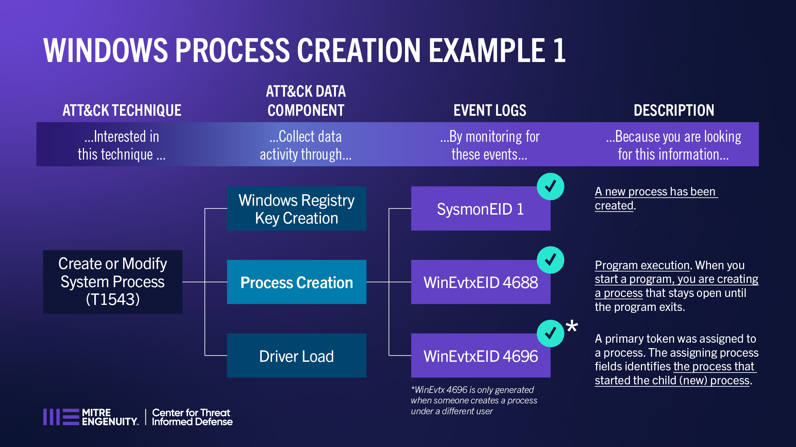
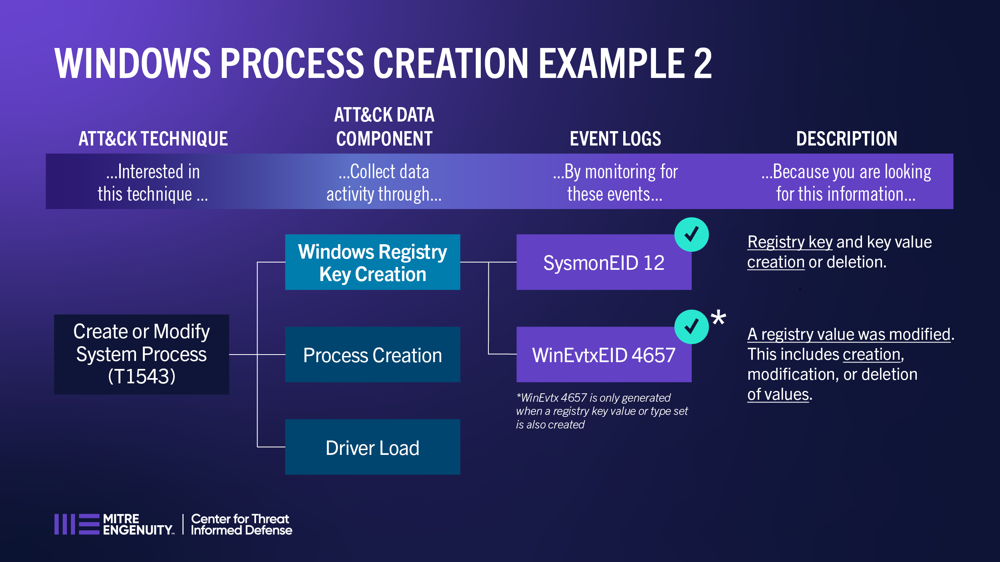

Windows Example Scenarios
=========================

Both Windows-based examples explore `Create or Modify System Process (T1543)
<https://attack.mitre.org/techniques/T1543>`__ and usage of the mappings done under this
project to provide visibility into that technique.

Example 1: Create or Modify System Process (T1543)
--------------------------------------------------

As identified in the SMAP mappings, process creation information can be collected by
Sysmon 1, WinEvtx 4688, WinEvtx 4696. This first example walks through why WinEvtx 4696
may not be a feasible detection for Create or Modify System Process (T1543).

**Looking at the event data, is this enough evidence to conclude that the process was
created or modified per T1543?** Let us examine each of the events in order to answer
this question.

**Sysmon EID 1:**

*Yes.* Sysmon EID 1 simply triggers when a new process is created, which (in this
context) may be created during installation of new software or as part of automated,
repeated execution of software such as services. This event's attributes provides
very detailed information about the process and the process execution, which is
enough to indicate that this technique (Create or Modify System Process) could have
occurred.

*References:*

* `Ultimate IT Security: Sysmon Event ID 1
  <https://www.ultimatewindowssecurity.com/securitylog/encyclopedia/event.aspx?eventid=90001>`__

**WinEvtx EID 4688:**

*Yes.* When a system process or a user opens an executable, Windows creates a process in which
that executable runs. Hence, this event is generated every time a program is started or executed.
All necessary details about the executed program, who the program ran as, and the process that
started the process are provided by the event. This provides evidence to indicate that this
technique (Create or Modify System Process) could have occurred.

*References:*

* `Ultimate IT Security: Windows Security Log Event ID 4688
  <https://www.ultimatewindowssecurity.com/securitylog/encyclopedia/event.aspx?eventid=4688>`__
* `Microsoft Learn: 4688(S) A new process has been created
  <https://learn.microsoft.com/en-us/windows/security/threat-protection/auditing/event-4688>`__

**WinEvtx EID 4696:**

*Maybe.* A primary token is an access token that is typically created only by the
Windows kernel and is assigned to a process to represent the default security
information for that process. Every process or thread executed on behalf of a user has a
copy of the token which is used to identify the user's identity and privileges. This
primary token is assigned to a process when the process is created, which is why this
event falls under process creation. This event, however, will only be generated when a
process (usually a service or a scheduled task) starts under the authority of a
different user than the user who created the process. In other words, this event
triggers every time a process runs using the non-current access token. To verify that
the access token is non-current we need to compare the Security ID, Account Name,
Account Domain, and Logon ID attributes of the new token information with the subject
information attributes provided by this event.

*Background:* An access token contains the security information for a logon session. The
system creates an access token when a user logs on, and every process executed on behalf
of the user has a copy of the token. The token identifies the user, the user's groups,
and the user's privileges. The system uses the token to control access to securable
objects and to control the ability of the user to perform various system-related
operations on the local computer. There are two kinds of access token, primary and
impersonation.

*Caveat:* This event does not generate when the process starts with the authority of the
same user that created the process. Therefore, if the new process has the same target
user as the user of the parent process, this event will not trigger. WinEvtx EID 4688
includes the primary token assigned to the new process. Also, this event is deprecated
starting from Windows 7 and Windows 2008 R2, with Windows Server 2008 and Windows Vista
as minimum OS versions.

*References:*

* `Ultimate IT Security: Windows Security Log Event ID 4696
  <https://www.ultimatewindowssecurity.com/securitylog/encyclopedia/event.aspx?eventid=4696>`__
* `Ultimate IT Security: Detailed Tracking Events
  <https://www.ultimatewindowssecurity.com/securitylog/book/page.aspx?spid=chapter6#ProCre>`__
* `Microsoft Learn: 4696(S) A primary token was assigned to process
  <https://learn.microsoft.com/en-us/windows/security/threat-protection/auditing/event-4696>`__
* `Microsoft Learn: Access Tokens
  <https://learn.microsoft.com/en-us/windows/win32/secauthz/access-tokens>`__

**Next, we review specific attributes of the event logs.**

Sysmon EID 1:

   * ProcessGuid
   * ProcessId
   * Image
   * CommandLine
   * CurrentDirectory
   * Hashes
   * ParentProcessGuid
   * ParentProcessId
   * ParentImage

WinEvtx EID 4688:

   * New Process ID
   * New Process Name
   * Token Elevation Type (1 - Default, 2 - Elevated, 3 - Limited)
   * Creator Process ID
   * Creator Process Name
   * Process Command Line

WinEvtx EID 4696:

   * Target Process ID
   * Target Process Name
   * New Token Information:
   * Security ID
   * Account Name
   * Account Domain
   * Logon ID

Example 2: Create or Modify System Process (T1543)
--------------------------------------------------

As identified in the SMAP mappings, Windows Registry key creation can be collected by
Sysmon 12 and WinEvtx 4657. This example walks through using these events to potentially
provide detection for Create or Modify System Process (T1543).

**Looking at the event data, is this enough evidence to conclude that the process was
created or modified per T1543?** Registry key creation/modification/deletion and key
value creation/modification/deletion events all have the event attributes necessary to
indicate that this technique (Create or Modify System Process) could have occurred.

**Sysmon EID 12:**

*Yes.* Sysmon EID 12 is triggered by CreateKey, DeleteKey, CreateValue, and DeleteValue
events. Newly created windows registry keys (i.e., CreateKey event) may create or modify
system-level processes to store and execute malicious payloads at startup or at
repeatable intervals as part of persistence or privileged escalation.

*References:*

* `Ultimate IT Security: Sysmon Event ID 12
  <https://www.ultimatewindowssecurity.com/securitylog/encyclopedia/event.aspx?eventid=90012>`__
* `Microsoft Learn: Sysmon Event-12 Q&A
  <https://learn.microsoft.com/en-us/answers/questions/883005/sysmon-event-12-eventtype-createvalue-event-only-n>`__

**WinEvtx EID 4657:**

*Yes.* This event is triggered when registry key values are created, modified, and deleted.
Accessing/opening and closing the registry key is determined by Windows EID 4656 and EID 4658,
respectively. This event will be generated when a new registry key is created with an initial
key value or key value type set.

*Caveat:* This event does not generate when a registry key is modified. Also, a newly created
registry key without a key value or key value type set will not trigger this event.

*References:*

* `Microsoft Learn: 4657(S) A registry value was modified
  <https://learn.microsoft.com/en-us/windows/security/threat-protection/auditing/event-4657>`__
* `Ultimate IT Security: Windows Security Log Event ID 4657
  <https://www.ultimatewindowssecurity.com/securitylog/encyclopedia/event.aspx?eventid=4657>`__

**Sysmon EID 6:**

*Yes.* Attaching a driver to the user or kernel-mode of a system, which triggers this event,
creates a new service driver installation and load. An adversary may use this service to
install and execute a malicious driver that can be leveraged as a rootkit, or load a signed
but vulnerable driver onto a compromised machine (known as "Bring Your Own Vulnerable Driver"
(BYOVD)). This event provides information about the driver being loaded, its hashes, and the
signature information for integrity purposes (signature validity, driver's publisher, and
signature status).

*References:*

* `Ultimate IT Security: Sysmon Event ID 6
  <https://www.ultimatewindowssecurity.com/securitylog/encyclopedia/event.aspx?eventid=90006>`__
* `Microsoft Learn: Sysmon v15.11
  <https://learn.microsoft.com/en-us/sysinternals/downloads/sysmon>`__
* `Atomic Red Team: T1543.003
  <https://github.com/redcanaryco/atomic-red-team/blob/master/atomics/T1543.003/T1543.003.md>`__
* `Sysmon Community Guide: Driver Loading
  <https://github.com/trustedsec/SysmonCommunityGuide/blob/master/chapters/driver-loading.md>`__

**Next, we review specific attributes of the event logs.**

Sysmon EID 12:

   * TargetObject
   * EventType (CreateKey, DeleteKey, CreateValue, DeleteValue)

WinEvtx EID 4657:

   * Object Name
   * Object Value Name
   * Operation Type (New registry value created, Existing registry value modified, Registry value deleted, etc.)
   * Change information ("Old Value Type", "Old Value", "New Value Type", "New Value")

Sysmon EID 6:

   * ImageLoaded (filepath of the driver loaded)
   * Hashes (of the driver loaded)
   * Signed (true/false)
   * Signature (Signer name of the driver)
   * SignatureStatus (i.e., valid)
