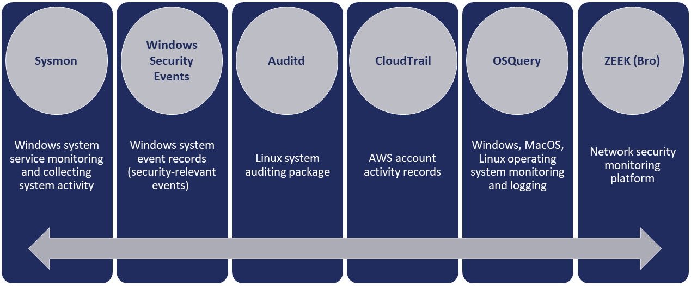

.. _Mapping Pages:

====================
Sensor Mapping
====================

**Mappings Resources**

* `Mappings Spreadsheet <https://github.com/center-for-threat-informed-defense/sensor-mappings-to-attack/blob/main/mappings/input/enterprise/xlsx/Sensor%20ID%20to%20Data%20Source%20to%20API%20v2.xlsx>`_: Spreadsheet of all in-scope sensor and event mappings to ATT&CK data objects.
* `ATT&CK Navigator Layers <https://github.com/center-for-threat-informed-defense/sensor-mappings-to-attack/tree/main/mappings/layers/enterprise>`_: Navigator layers of sensors and events mapped to data objects associated with specific (sub-)techniques.

**Sensor Scope**

The scope of this project includes mappings to ATT&CK Data Sources from Host Sensors, which 
gather data from endpoints in the environment (e.g., Windows, Linux), and Network Sensors, 
which gather data gather from network communications, typically outbound connections.

The specific sensors mapped are:

.. toctree::

    mapping_auditd
    mapping_cloudtrail
    mapping_osquery
    mapping_sysmon
    mapping_winevtx
    mapping_zeek

