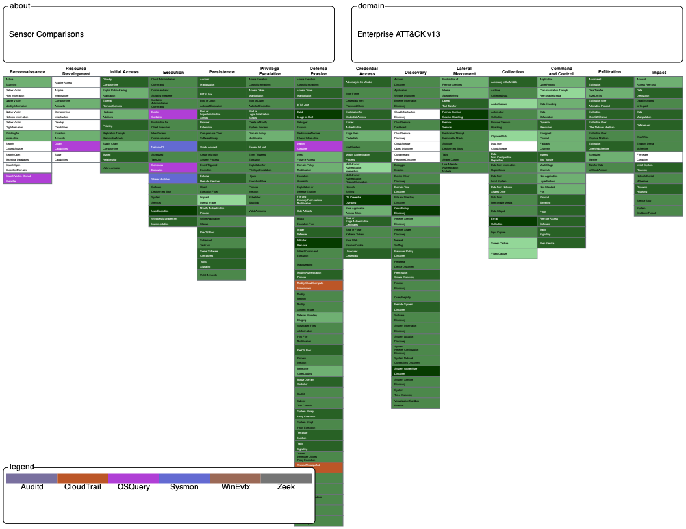

Sensor Mapping
==============

The scope of this project includes mappings to ATT&CK Data Sources from Host Sensors,
which gather data from endpoints in the environment (e.g., Windows, Linux), and Network
Sensors, which gather data gather from network communications, typically outbound
connections.

The initial SMAP work was developed using ATT&CKv13.1. The mappings include some data 
components that are not represented in ATT&CKv13.1 and may not be represented in more
recent versions of ATT&CK. The reason for this is that ATT&CK does not include data
components that do not currently have a relationship to a (sub-)technique. These 
mapped data components are being tracked by the ATT&CK team and will be considered for 
incorporation in future versions of ATT&CK as the overall ATT&CK catalog evolves.

View Mappings
-------------

.. raw:: html

    

        <a class="btn btn-primary" target="_blank" href="../xlsx/Sensor%20ID%20to%20Data%20Source.xlsx">
        <i class="fa fa-file-excel-o"></i> Download Mappings – Excel</a>
    

You can download a spreadsheet containing the mappings for all sensors or dive into the
details for a specific sensor:

.. toctree::
    :maxdepth: 1

    mapping_auditd
    mapping_cloudtrail
    mapping_osquery
    mapping_sysmon
    mapping_winevtx
    mapping_zeek

.. image:: ../_static/sensors.png

Visualize Coverage
------------------

.. raw:: html

    

        <a class="btn btn-primary" target="_blank" href="https://mitre-attack.github.io/attack-navigator/#layerURL=https://center-for-threat-informed-defense.github.io/sensor-mappings-to-attack/navigator/Auditd-heatmap.json">
        <i class="fa fa-map-signs"></i> Open Sensor Coverage in ATT&CK Navigator</a>
    

The Navigator layer connects sensors → data sources → techniques. Each sensor is color
coded to the techniques that it is mapped to. Techniques with multiple sensors are
shaded in green: lighter green means fewer sensors and darker green means more sensors.

