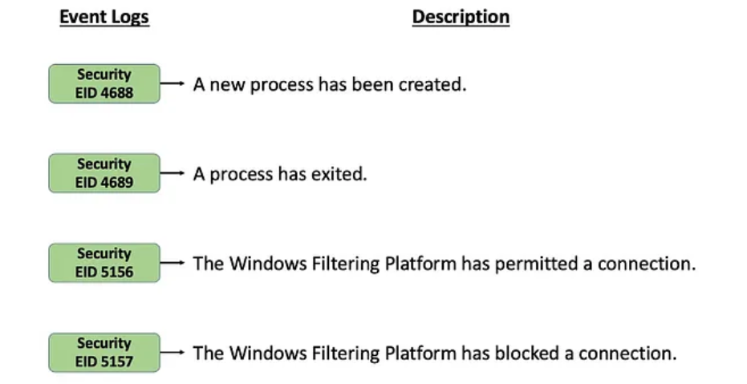
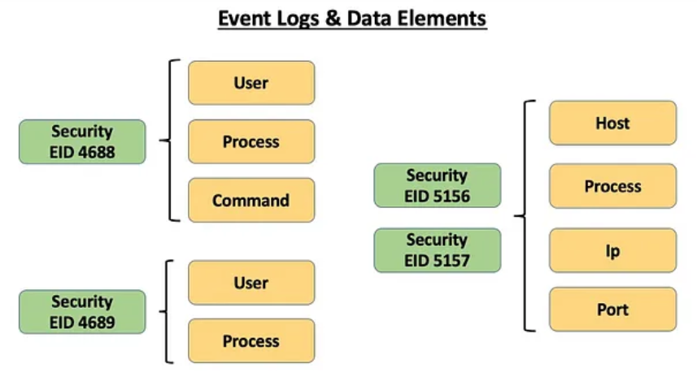

Mapping Methodology
===================
..
   Incorporate Methodology notes from Confluence

The Sensor Mapping to ATT&CK project links event values in sensors and log files to ATT&CK Enterprise Data Sources. The resultant mappings can be used to either take a sensor event value and determine associated ATT&CK techniques and sub-techniques, or to take an ATT&CK technique or sub-techniques and compose a list of associated sensor events. This methodology describes the scope of this project and the process used to map events native to a technology platform to ATT&CK Data Sources, and aims to provide the community a reusable method of using ATT&CK to determine the capabilities of a platform's security offerings.

MITRE ATT&CK® is a globally-accessible knowledge base of adversary
tactics and techniques based on real-world observations. ATT&CK focuses
on how external adversaries compromise and operate within computer
information networks. ATT&CK describes adversary behaviors using the following core
components:

-  **Tactics:** "why" - the adversary's objective or reason for
   performing an action

-  **Techniques:** "how" - the means by which adversaries achieve
   tactical goals

-  **Sub-techniques:** describing more specific means by which
   adversaries achieve tactical goals at a lower level than techniques

-  **Data Source:** source of information collected by a sensor or logging system that may be used to collect information relevant to identifying the action being performed, sequence of actions, or the results of those actions by an adversary

-  **Data Component:** any constituent pieces of the data source, which are best described separately. Components may have their own set of metadata (describing the associated fields/values associated with the source) and activities (describing actions of the source).

**Data Elements:** names, definitions, and attributes that are being used or captured in an event

**Sensors:** an agent or service capable of detecting or measuring information across many different sources on a host in real-time and providing raw data with high precision and accuracy 

**Telemetry/Events:** generated by sensors in the form of log data, regardless of the format (e.g., json, csv, etc.), as long as the data is automatically generated and transmitted or streamed in near real-time

Scope
-----

Scoping for this project is focused on mappings for the following security logs, sensors, and capabilities:

- Windows Security Events
- Sysmon
- Auditd
- CloudTrail
- OSQuery
- ZEEK

..
   Expand this section. Consider explaining event scope here as well (from step 1 below).

Mapping Philosophy and Process
------------------------------
..
   Develop graphic for this section.

Mappings are created by analyzing each in-scope event log/sensor in relation to ATT&CK Data Sources. Sensors/log files and ATT&CK are at different levels of abstraction and cannot always perfectly detect the adversary behaviors that they are meant to represent. Some amount of analyst judgement is required and, whenever judgement is involved, there can be differences in opinion. These design decisions document our judgement and rationale.

The methodology consists of the following steps:

- **Identify Platform Events/Telemetry** - Identify the *native* event logs available on the platform.
- **Event ID Review** - For each identified event, understand the security capabilities it provides.
- **Identify Mappable ATT&CK Data Sources** - Identify the ATT&CK Data Sources mappable to event IDs.
- **Create a Mapping** - Creating a mapping based on the information gathered from the previous steps. 

Step 1:  Identify Platform Events/Telemetry
-------------------------------------

Sensors/Tools generate logs of real-time data that is indicative of a sequence of actions conducted by the user of a computer system. With those actions having a potential to inform a defender of adversary activity, this is the first location to look for further evidence. Typically, Sensors can be broken out into 2 categories: 

**Host:** data gathered from endpoints in the environment (e.g., Windows, MacOS, Linux)
   
   - Examples: 
      - Windows Event Logs
      - Sysmon
      - OSQuery
      - EDR Products (Carbon Black, Crowdstrike, Microsoft Defender ATP, etc.)
      - Services, Processes, Command-lines, Loaded Modules, DLLs
      - Files, Registry
      - Scheduled Tasks, Cron Jobs, Launch Agents
      - User Account, Hardware Info
      - Memory Data 

**Network:** data gathered from network communications, typically outbound connections

   - Examples: 
      - Firewall Logs
      - Proxy Logs
      - IDS/IPS Logs
      - Netflow Data 
      - Bro/Zeek
      - Packet Capture

Sensor documentation on the security capabilities of each platform (e.g., security reference architectures, security benchmarks, security documentation of various services) is reviewed to identify event IDs offered by the platform for detecting workloads on the platform. 

..
   more info about events/telemetry? or maybe images?

Keep the following in mind while selecting event IDs:

- The scope of the events mapped by this project is telemetry that can be collected by a sensor or logging system that may be used to collect information relevant to identifying the action being performed, sequence of actions, or the results of those actions by an adversary. 
- The selected events should be native to the platform, i.e., produced by the operating system themselves. For example, event IDs developed directly in a third-party tool are considered out of scope.
- The event IDs selected to be mapped as part of this project tend to be events that are marketed as native and made available on the platform. The intent is not to provide a mapping for all settings/features of individual platform services that are security related. This is a non-trivial undertaking that may be explored at a later time.

Step 2:  Event ID Review
------------------------

What makes sensors/tools useful to defenders is the meaning and context associated with the event/telemetry. For each identified event ID, consult the available documentation to understand its capabilities. Gather specific facts about the event ID that will later help in mapping the event to the set of ATT&CK Data Sources it is able to detect. The most common way to bring context to data is by applying the description and other types of metadata (Data Elements/Fields). When documented these Data Fields can help us understand our capabilities/gaps, and make creating detections more efficient.

Start with identifying the source of data. In a Windows environment, we can collect information pertaining to "Processes" from built-in event providers such as Microsoft-Windows-Security-Auditing and open third-party tools, including Sysmon. This step also takes into account the overall event where a process can be represented as the main data element around an adversary action. This could include actions such as a process connected to an IP address, modifying a registry, or creating a file.

Documenting security telemetry collected within a network environment will provide us with data and information that should help us to answer to questions such as *why were these security events generated in my environment? (Activity)*, *what operating system supports its generation? (Platform)*, *where were they collected? (Collection Layer)*

Example: Let's use security event *4688: A new process has been created* provided by *Microsoft Windows security auditing* as a basic example to understand this step of the methodology. The action that triggered the generation of this event was the creation of a new process (Activity). This security event can be collected by using the built-in event logging application for devices that work with the Windows operating system (Platform). Because we are working with a built-in application, this security event was collected at the host level.

Next in reviewing the event ID, *identify the data element*. Once we identify and understand more about sources of data that can be mapped to an ATT&CK data source, we can start identifying data elements within the data fields that could help us eventually represent adversary behavior from a data perspective. The image below displays how we can extend the concept of an event log and capture the data elements featured within it. 

Note: Pay attention to the differences between similar data sources and events. Two events with the same field names can represent different data. 

Step 3: Identify Mappable ATT&CK Data Sources 
---------------------------------------------
Adversary behaviors can be described by mapping them to the appropriate tactics, techniques, and sub-techniques in ATT&CK. To detect these behaviors, ATT&CK has a detection section that maps directly to the collection source (data sources). 

`ATT&CK's Data Sources <http://attack.mitre.org/datasources/>`_ usually fall into one of the following buckets: 

- Granular basic system artifacts (e.g., process, file, registry)
- Granular basic user activities (e.g., logon session)
- Abstract types of system artifacts, with children as sub-types (e.g., scheduled jobs)
- Associated network traffic (e.g., wmi and registry), in such cases, it's important to capture the set of protocols that encompasses this traffic, so that users may understand where they need to look in their logs/PCAPs/DPI appliances/etc.

The data source list can incorporate different variations of how the action could be performed for a particular technique. This attribute is intended to be restricted to a defined list to allow analysis of technique coverage based on unique data sources. For example, "what techniques can I detect if I have process monitoring in place?" 

After understanding the capabilities of the event ID and gathering the basic facts about its operation, as identified in the previous step, review the ATT&CK matrix and identify the data source the event is able to detect. 

Step 4:  Create A Mapping
-------------------------
The previous steps enabled you to gather the information required to create a mapping file for an event. As pulled from the original `ATT&CK's Data Source Methodology <https://github.com/mitre-attack/attack-datasources/blob/main/docs/methodology.md>`_ the below is what we are looking for when reviewing events:
- Identifying Sources of Data:
   - Why were these security events generated in my environment?
   - What operating system supports its generation?
   - Where were they collected? 
- Identifying Data Elements
   - Data Elements help us not only to represent (elements) and describe (attributes) relevant network security concepts, but also to get a better understanding of the interactions (relationships) among them. 
- Identifying Relationships Among Data Elements 
   - By documenting telemetry collected within a network environment we were able to identify the activity that triggered the generation of security telemetry and data elements that were involved in an action
- Identifying Telemetry Source (ETW/Kernal Callbacks/APIs/etc.)
