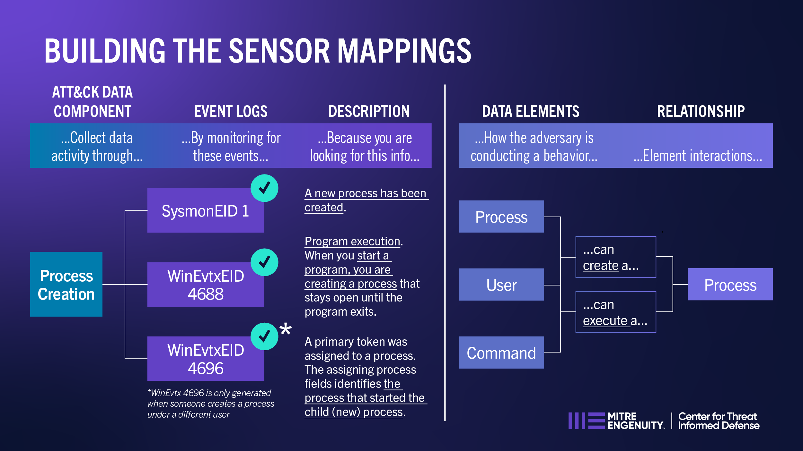

Mapping Methodology
===================

Philosophy
----------

Mappings are created by analyzing each in-scope sensor in relation to ATT&CK Data
Sources. Events collected by sensors are at a different level of abstraction than ATT&CK
objects, so they cannot always perfectly detect the adversary behaviors that they are
mapped to. By completing the connection of conceptual data sources and components to
concrete logs, sensors, and other security capabilities, cyber defenders have
information to help identify relevant security data to collect for specific behaviors
and environments.

Process
-------

The Sensor Mappings to ATT&CK mapping methodology consists of the following steps:

.. toctree::
    :hidden:

    step1
    step2
    step3

- :doc:`step1`: Identify the types of events the sensor can emit.
- :doc:`step2`: For each identified event, understand the security capabilities it provides.
- :doc:`step3`: Identify the ATT&CK Data Sources mappable to event IDs.
