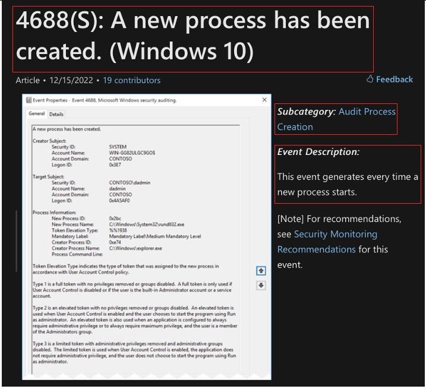

Step 2: Definition Correlation
===============================

What makes sensors useful to defenders is the meaning and context associated with the event. For each identified event ID, 
consult the available documentation to understand its capabilities. Gather specific facts about the event ID that will 
later help in mapping the event to the set of ATT&CK Data Sources it is able to detect. 

The most common way to bring context to the event is by applying the description and other types of metadata such as the 
Data Elements and Fields. Documented description, elements, and fields can help provide understanding of what the sensor is 
truly capturing, and make creating mappings more efficient.

Identify the Source of Data 
---------------------------

Start with **identifying the source of data**. In a Windows environment, we can collect information pertaining to "Processes" 
from built-in event providers such as Microsoft-Windows-Security-Auditing and open third-party tools, including Sysmon. 

Additional context on potential source of the data can be gained by considering: 

- *Why were these security events generated in my environment? (Activity)*
- *What operating system supports its generation? (Platform)*

For example, the documentation provided by Microsoft for Windows `Event ID 4688: A new process has been created <https://learn.microsoft.com/en-us/windows/security/threat-protection/auditing/event-4688>`_ 
provides context for this event. By the event description, 4688 is generated every time a new process starts. The information 
provided by this event includes the user account that requested the creation of the process, and information of a process that 
executed a new process. This event also provides metadata that can help us to describe the data elements needed later on in 
Step 3 of this methodology.

- The action that triggered the generation of this event was the creation of a new process (Activity). 
- This security event can be collected by using the built-in event logging application for devices that work with the Windows 
operating system (Platform). Within a Windows environment, it is typically known to have a "process" as a source of data. 

Correlate to ATT&CK Data Component Definition
---------------------------------------------

To correlate with ATT&CK, the `Data Source <https://attack.mitre.org/datasources/>`_ pages provide definitions for each 
individual Data Source. 

For Process Creation, ATT&CK's definition is : **..the initial construction of an executable..**. Through key word review, it 
can be determined that this is the same as **..a process is created..** Therefore, event ID 4688 can be linked with this 
ATT&CK Data Component. 

A similar process can be used to examine Sysmon EID 1, Sysmon EID 8, WinEvtx 4688, and WinEvtx 4696. The image below shows that 
the definitions all have some correlation with either starting or executing a process. 

.. image:: ../_static/DefinitionCorrelation_Ex.png
   :width: 700