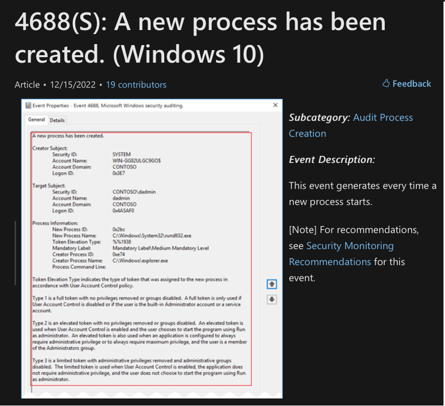
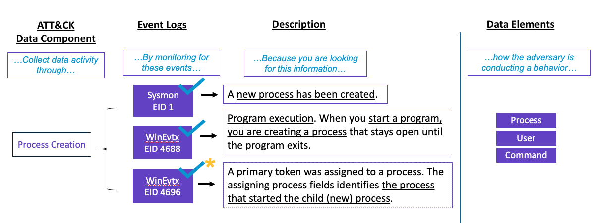
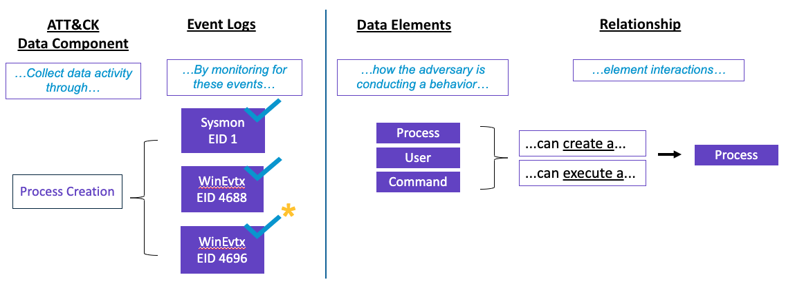

Step 3: Relationship Correlation
================================

Identify the Data Element
-------------------------

The next step in reviewing the event ID is **identify the data element**. Once more about sources of data 
that can be mapped to an ATT&CK Data Source is identified and understood, data elements within the event 
fields potentially representing adversary behavior can start to be identified from a data perspective. 

As mentioned in Step 2, `Event ID 4688: A new process has been created <https://learn.microsoft.com/en-us/windows/security/threat-protection/auditing/event-4688>`_ also provides attributes 
that can help to describe the data elements needed. For instance, regarding the user account data element, 
information on the logon ID and the domain it belongs to is collected. 

The use of Data Elements helps to understand key attributes that are related to the adversary behavior. 
For example, if an adversary behavior modifies a Windows Registry value, collection of Windows Registry 
telemetry is needed for visbility of that behavior. 

Additional context on how to establish data elements can be gained by considering: 

- *How is the adversary conducting a behavior?*
- *What are all the data objects that define the context of the data source?*
- *What are some attributes from the event log that contributes to the activity of the adversary behavior?*

This method can also be used to provide a general idea of what information needs to be collected. 

Note: There is a fundamental rule that should be considered when defining: **there is no one correct way to 
define data elements**. Please look to your organizational needs to help define what data elements mean to you.

Identify Relationships among Data Elements
------------------------------------------

By documenting the event collection, source (creation of a new process), and data elements (user account and 
process), descriptions of **interactions among elements through relationships** can start to be documented. 

Note: Relationships in ATT&CK have been categorized between *activity* and *information*. Activity 
relationships are the ones that make references to the action that triggered the generation of the event. 
Informational relationships are the ones defined based on the metadata provided by the event. Therefore, 
please be aware of alternative data elements (i.e., a thread can create a process).

As discussed by `OSSEM <https://github.com/OTRF/OSSEM>`_ at their ATT&CKcon 2018 and 2019 presentation, the activity of the 
relationship leads to Data Components. Data Components will help to categorize relationships among data elements 
based on the security context they describe (i.e., Creation, Execution, Deletion).