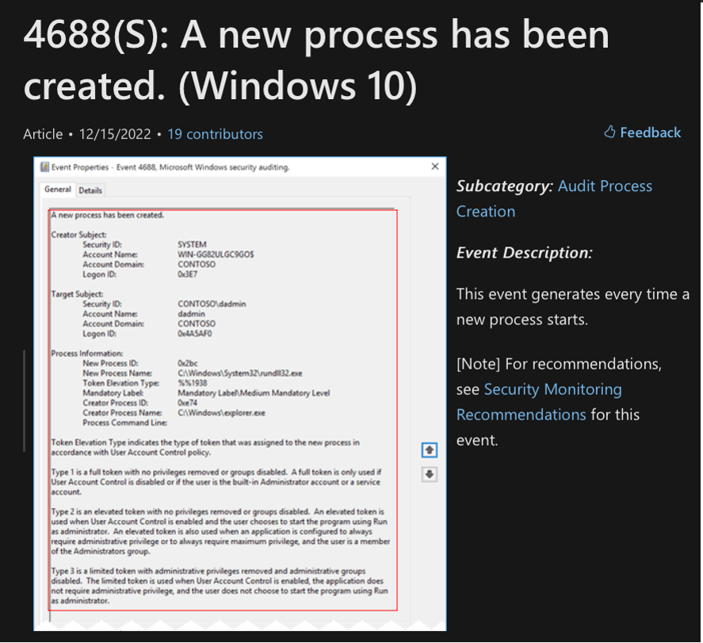
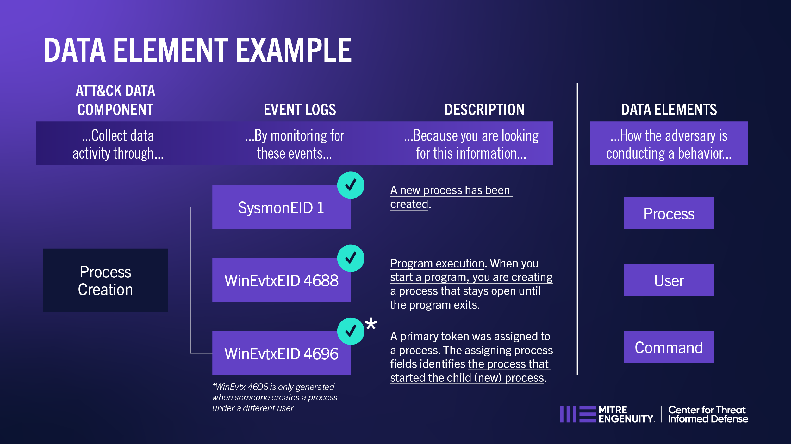
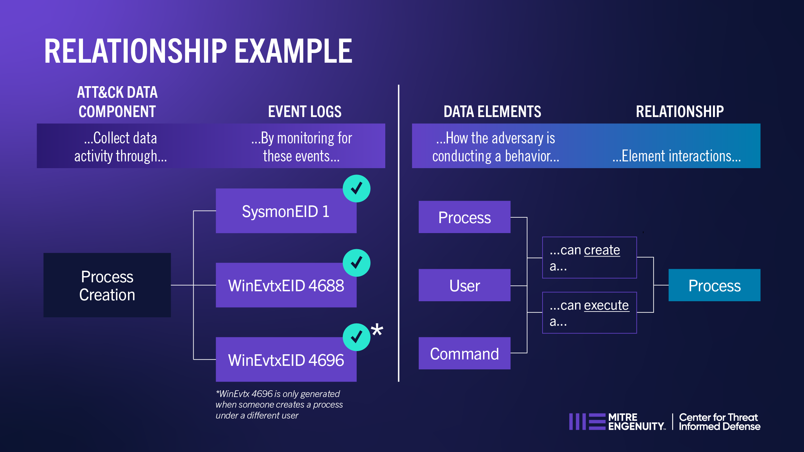

Step 3: Relationship Correlation
================================

Identify the Data Element
-------------------------

The next step in reviewing the event ID is **identify the data element**.  As mentioned
in Step 2, `Event ID 4688: A new process has been created
<https://learn.microsoft.com/en-us/windows/security/threat-protection/auditing/event-4688>`_
provides attributes that describe the data elements needed, such as the logon ID and the
domain it belongs to.

The use of Data Elements helps to understand key attributes that are related to the
adversary behavior. For example, if an adversary behavior modifies a Windows Registry
value, then defenders need to collect Windows Registry telemetry to get visbility into
that behavior.

Additional context on how to establish data elements can be gained by considering:

- *How is the adversary conducting a behavior?*
- *What are all the data objects that define the context of the data source?*
- *What are some attributes from the event log that contribute to the activity of the
  adversary behavior?*

This method can also be used to provide a general idea of what information needs to be
collected.

.. tip::

   **There is not just one correct way to define data elements**. Please look to your
   organizational needs to help define what data elements mean to you.

Identify Relationships among Data Elements
------------------------------------------

By documenting the event collection, source (e.g. creation of a new process), and data
elements (e.g. user account and process), defenders can start to document descriptions
of **interactions among elements through relationships**.

.. tip::

   Relationships in ATT&CK have been categorized between *activity* and *information*.
   Activity relationships are the ones that make references to the action that triggered
   the generation of the event. Informational relationships are the ones defined based
   on the metadata provided by the event. Therefore, please be aware of alternative data
   elements (i.e., a thread can create a process).

As discussed by `OSSEM <https://github.com/OTRF/OSSEM>`_ at their ATT&CKcon 2018 and
2019 presentation, the activity of the relationship leads to Data Components. Data
Components help to categorize relationships among data elements based on the security
context they describe (i.e., Creation, Execution, Deletion).
